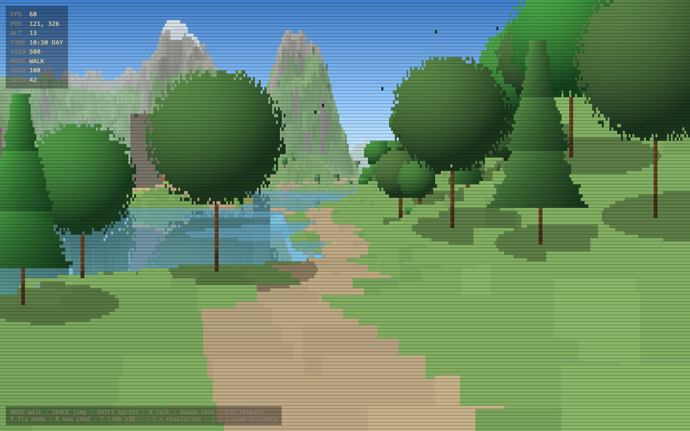
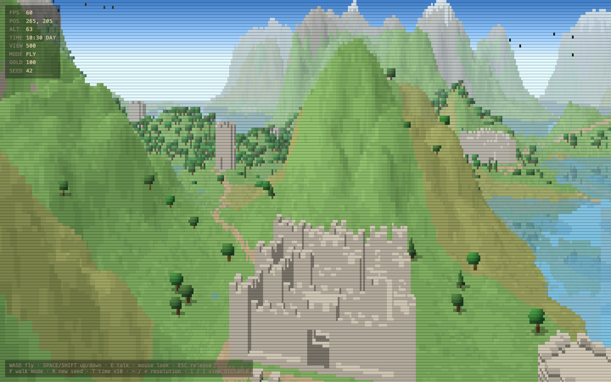
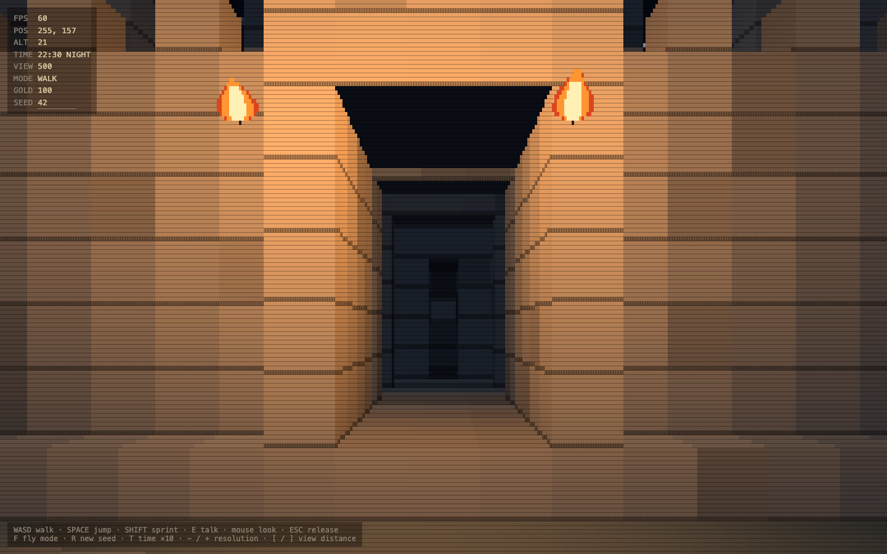
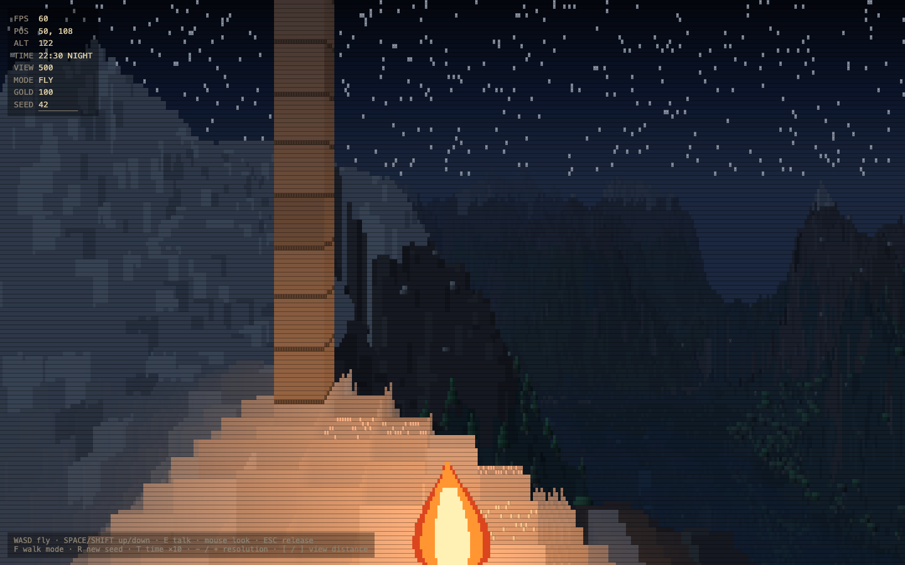
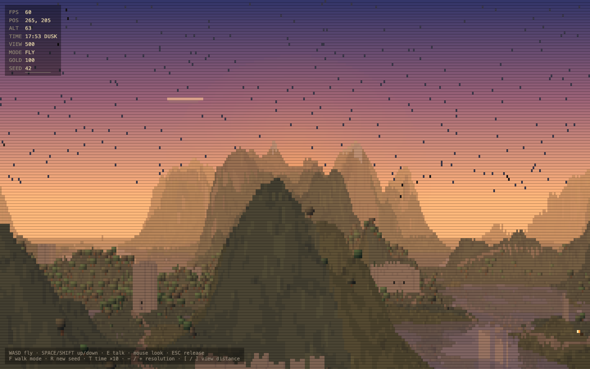
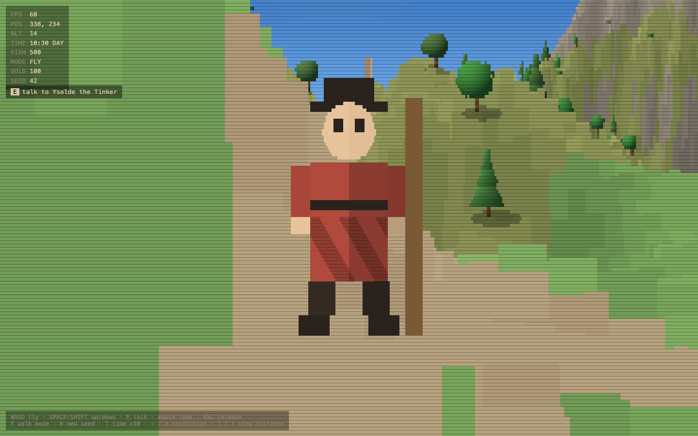
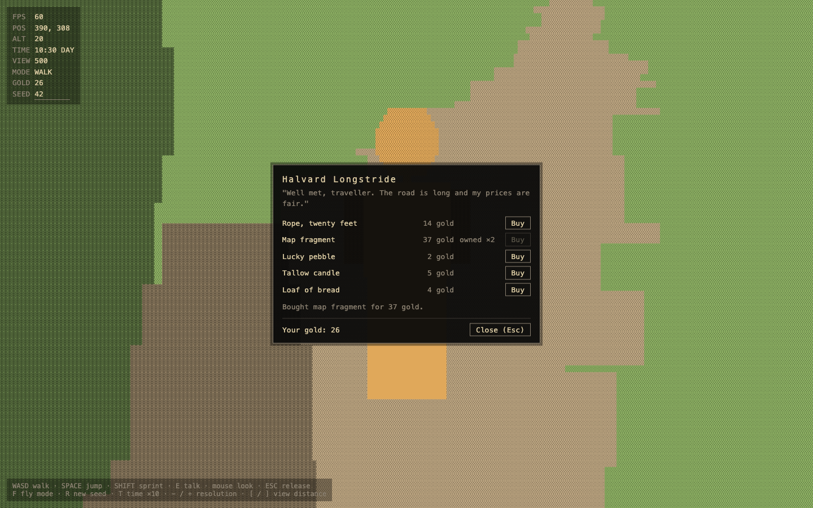
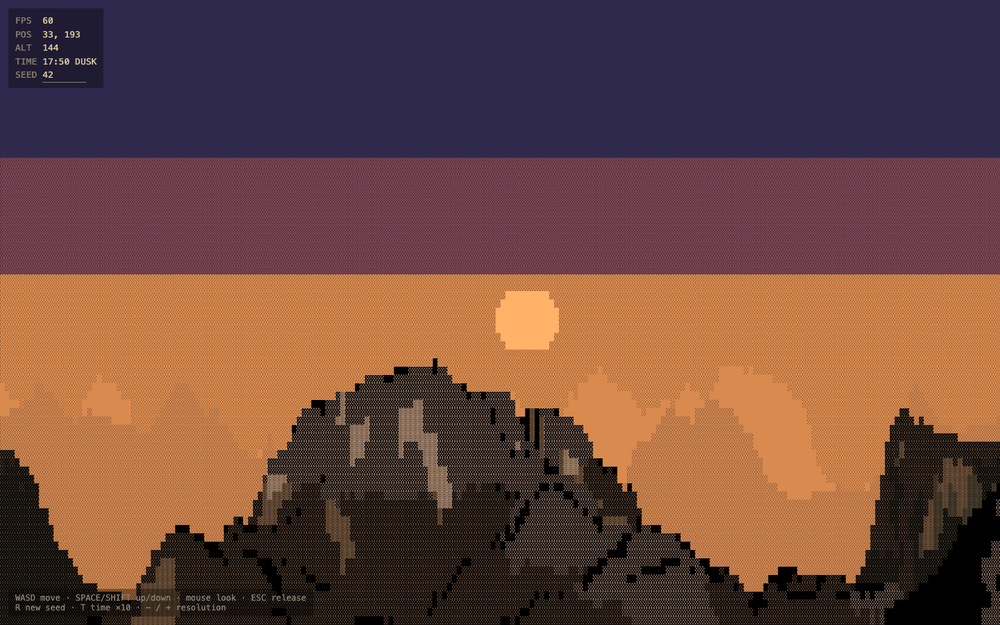
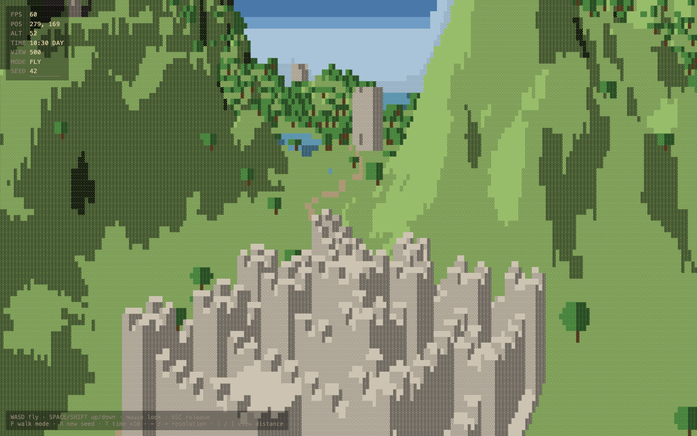
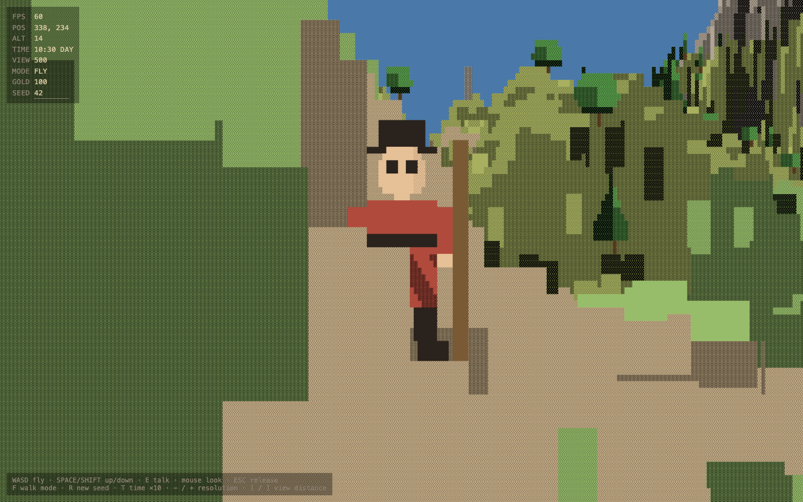

# Text Voxel

A first-person explorer whose whole world is drawn as a mosaic of text characters, in the spirit of the Voxel Space / Comanche heightmap engines. One HTML file, no dependencies, no build step: open `index.html` in a browser and it runs.

## What's in it

- A seeded, procedurally generated 512×512 world that wraps at the edges: rolling terrain with ridged mountains, a sea, carved rivers, forests, bushes and boulders, drifting clouds and flocks of birds.
- Landmarks built as small voxel structures anchored to the ground: three castle designs (small, keep castle, three-ring concentric castle) with gatehouses, courtyards and keeps you can walk into and climb, round towers with spiral stairs, ruins, and standing-stone circles.
- A road network joining every landmark, found by pathfinding that prefers gentle ground and fords water only where it must.
- Four travelling merchants walking the roads. Press `E` near one to open a trade panel with a name, a greeting and a few goods; a gold counter lives in the HUD.
- Grounded first-person movement with gravity, jump, sprint, and collision against walls, tree trunks, ceilings and steep slopes; `F` toggles a free fly camera.
- A four-minute day: the sun and moon move, the palette crossfades through dusk and night, stars come out, and after dark torches light the gates, campfires burn by the stones and merchants carry lanterns.
- A renderer that raymarches the heightmap and the structures per screen column into a grid of ~4×7 px cells, each one glyph and one colour, composed into pixels every frame; lakes reflect what stands on their far shore.

## Screenshots

| | |
|---|---|
|  |  |
|  |  |
|  |  |

The look evolved over seven phases, from a five-band posterised character raster to the current smooth-colour glyph mosaic:

| Phase 1: five bands, 7×12 px cells | Phase 4: posterised, landmarks and roads | Phase 6: block-shape merchant |
|---|---|---|
|  |  |  |

## Controls

| Key | Action |
|---|---|
| Click | capture the mouse (Esc releases it) |
| Mouse | look around |
| W A S D | walk (or fly) |
| Space | jump (walking) · ascend (flying) |
| Shift | sprint (walking) · descend (flying) |
| F | toggle walk / fly |
| E | talk to the merchant named in the prompt |
| R | new random seed |
| T | run the clock 10× faster |
| − / + | smaller / larger cells |
| [ / ] | view distance |

`?seed=123` in the URL loads a specific world; the seed box in the HUD does the same.

## How it works

[docs/project.md](docs/project.md) walks through every system in plain English: terrain and rivers, the raymarch and its painted mask, structure templates and placement, roads, sprites and the depth buffer, walking and collision, merchants, the palette and lighting pipeline, reflections and lights, and the decisions and limits behind each.

## Status

Built phase by phase in September 2026 as a single-file experiment. Movement, generation and collision are tested with scripted walks (every gate, every tower stair); the renderer is verified in Chromium, Firefox and WebKit at 1440×900 at 60 fps.
